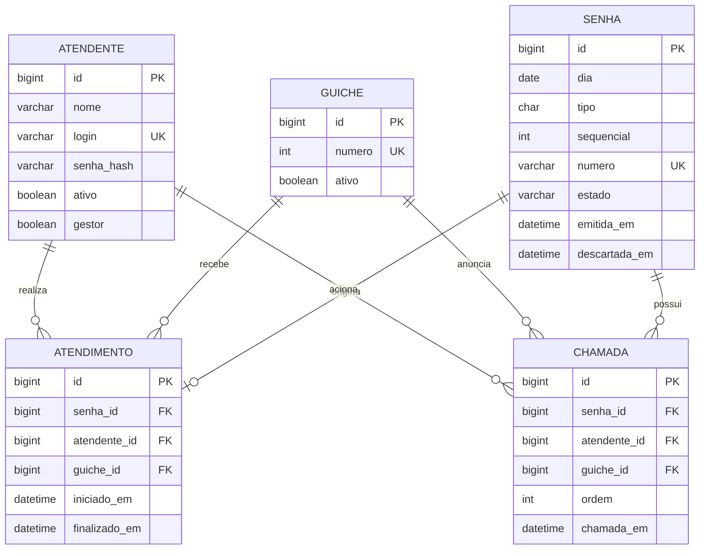

# Modelo de dados proposto - fase 2

O sistema já possui persistência MySQL em tickets, calls e queue_control; o schema está em backend/sql/001_initial.sql. O MER abaixo é a proposta ampliada, com atendentes e gestão ainda pendentes. Veja docs/MYSQL.md para o modelo efetivamente implementado.

## Restrições e complementos

- `SENHA`: unicidade composta `(dia, tipo, sequencial)`; tipo em SP/SE/SG; sequencial entre 1 e 999.
- `ATENDIMENTO.senha_id`: único; somente criar ao iniciar o serviço. Isso permite deixar campos de atendimento vazios no relatório de ausentes, preservando a auditoria de chamadas.
- `CHAMADA`: ordem 1 ou 2, unicidade `(senha_id, ordem)`.
- Um único gestor: manter referência ao gestor em registro singleton de configuração, ou outra restrição transacional equivalente. Um booleano sozinho não garante a regra.
- Controle de fila/dia e contadores precisarão de tabelas auxiliares com bloqueio transacional. Guardar o tipo da última chamada global para aplicar a alternância entre guichês.
- Controle de guichês ativos deve garantir no banco que uma senha reservada e um guichê não sejam usados por dois atendimentos simultâneos.
- Auditoria completa pode exigir tabela imutável de eventos com identidade do AA e transições. O modelo acima cobre os eventos centrais, não todos os eventos de segurança.
- Não armazenar nome, CPF ou resultado de exame do cliente para organizar a fila.

## Métricas propostas

Tempo de atendimento = finalizado_em - iniciado_em, somente para concluídos. Tempo de espera = iniciado_em - emitida_em. Exibir contagem, média por tipo e período, volume por hora e proporção de ausência. Evitar usar métricas isoladas como ranking de atendentes sem considerar tipo de serviço e carga de trabalho.
