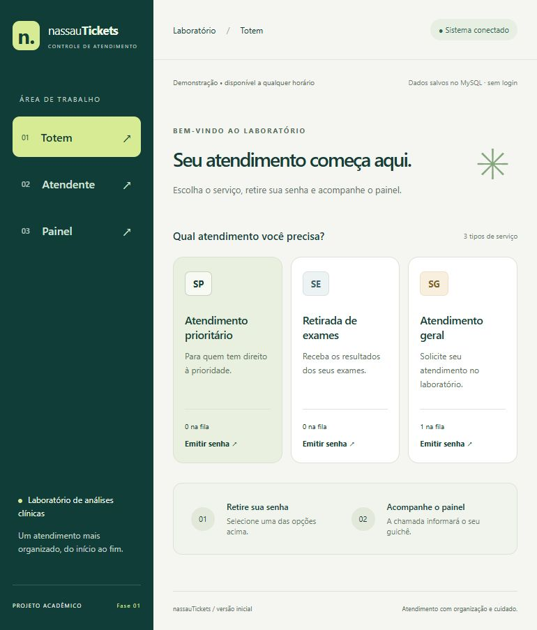

# Telas e roteiro de validação

O frontend é o protótipo navegável. Inicie os servidores conforme o README e abra a porta 5173.

Imagem da tela de emissão verificada em 02/10/2026:



## Totem

```text
Menu: Totem | Atendente | Painel
Seu atendimento começa aqui.
[ SP - Prioritário ] [ SE - Exames ] [ SG - Geral ]
Cada cartão: quantidade em espera + Emitir senha
Após emissão: [ SUA SENHA 261002-SP001 | Concluir ]
```

## Atendente

```text
Seu guichê: [ 01 / 02 / 03 ]
Livre: [ Chamar próxima senha ]
CHAMADA: número + [ Chamar novamente ] [ Iniciar atendimento ]
CHAMADA_NOVAMENTE: número + [ Iniciar atendimento ] [ Não compareceu ]
EM_ATENDIMENTO: número + [ Finalizar atendimento ]
```

## Painel

```text
SENHA CHAMADA (ou ÚLTIMA CHAMADA)
            261002-SP001
              Guichê 01
Últimas 5 chamadas: número | guichê | horário
```

O painel não mostra a fila futura. Todas as telas exibem o estado da conexão e identificam o modo demonstração. A próxima versão separará permissões e rotas públicas das telas internas.

## Roteiro manual de aceitação

1. Emitir dois SP, um SE e um SG; verificar sequenciais por tipo.
2. Chamar e finalizar sucessivamente; esperar SP001, SE001, SP002, SG001.
3. Verificar no painel a atualização de cada chamada sem exibir a próxima senha.
4. Testar segunda chamada; conferir “Última chamada”. Confirmar ausência e verificar liberação do guichê.
5. Usar guichês 1 e 2; uma senha não pode aparecer ativa nos dois.
6. Desligar o backend; esperar o aviso de desconexão. Botões de ação devem ficar desabilitados. Reiniciar restaura conexão, preservando os dados salvos no MySQL.
7. Navegar usando Tab/Enter e conferir foco, rótulos e mensagens.
8. Reduzir a janela para largura de celular; verificar ausência de rolagem horizontal e acesso a todos os botões.
9. Executar os testes automatizados para validar os limites do expediente sem alterar o relógio do computador.

Resultado esperado não equivale a teste executado pela equipe; registrar evidências da revisão antes da entrega.
