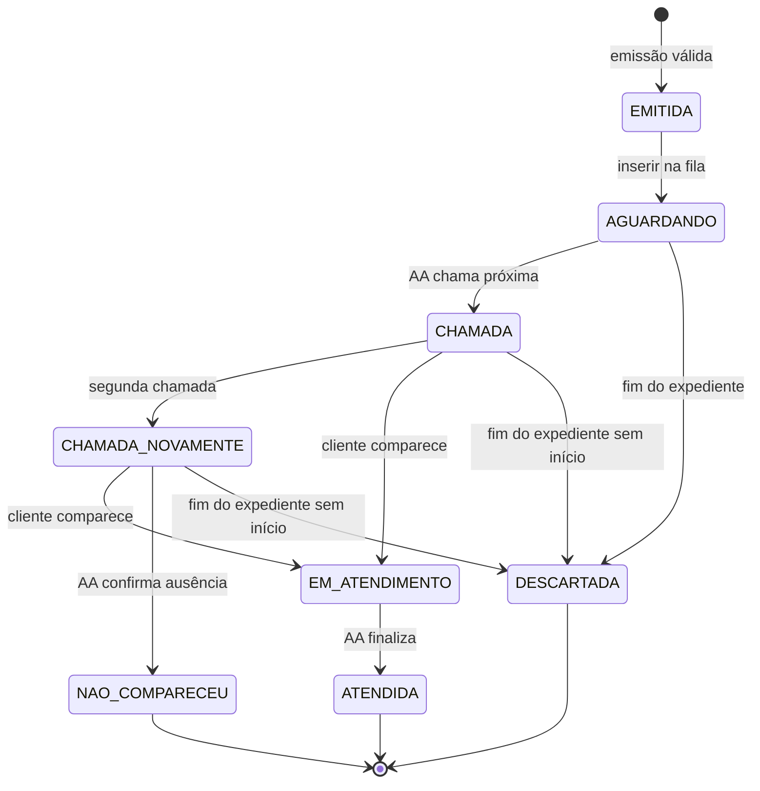
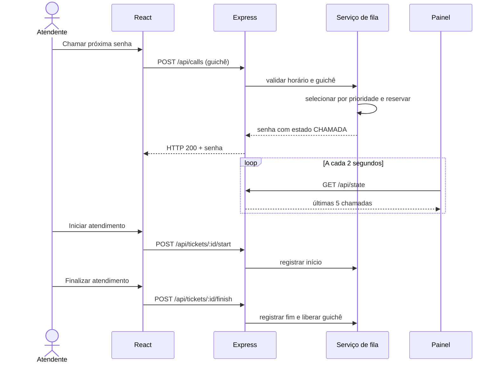

# Diagramas iniciais

Os blocos Mermaid podem ser visualizados no GitHub. Para a fase 2, atualizar os diagramas junto das alterações do código.

## Máquina de estados

NAO_COMPARECEU corresponde ao valor `NÃO_COMPARECEU` da implementação. EMITIDA é um estado conceitual transitório; a criação já retorna AGUARDANDO. A segunda chamada é opcional quando o cliente chega na primeira.

## Sequência de chamada

Na versão persistente, a reserva e o registro devem ocorrer em uma transação do banco. Login e autorização serão adicionados antes das operações do AA.
